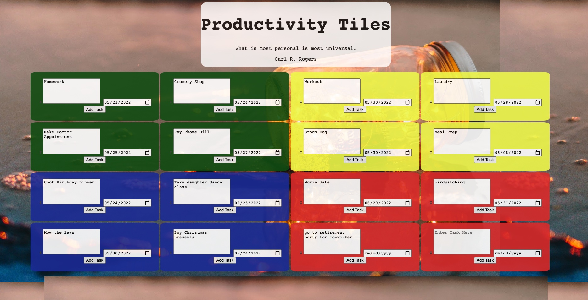

# ProductivityTiles

The Eisenhower Matrix is an organization system that allows you to organize your tasks from “MUST do now” to “Delete”, not needed to finish today.
Our app, with the help of the theory behind the Eisenhower Matrix, will help you to…
· Rank your most important and urgent tasks above the rest
· Eliminate time-wasting tasks, by helping you identify the non-essential ones
· With our simple but easy-to-use interface, you can create your tasks
· And then position them as you want
· With everything laid out in front of you, you can create more mental space to make progress on your goals
Productivity Tiles helps you become your best you!

## User Story

As a user
I want to be able to prioritize my most important tasks out of a pool tasks and
I want to be able to connect my events to real time so that I am up to date in my tasks.
So that I can plan my schedule efficiently

### Acceptance Criteria

GIVEN the user has a list of tasks and todos
WHEN the user enters a task in the input
THEN the site saves to local storage.

WHEN the user moves tiles into the four different categories
THEN the color of priority changes.

WHEN situation changes and a certain has become more important
THEN you can click and drag to reorder the list

WHEN task sits idle for too long
THEN the user is given an inspiration quote to forge on and finish their tasks

[Github Pages](https://anacecyflores1.github.io/ProductivityTiles/)

### Collaborators

Ana C. Flores: anacecyflores1@gmail.com

Tom Lee : t.k.hobbes43@gmail.com

Cristian Vargas: cristian.v0223@gmail.com

Luka Eric: lukaericba@gmail.com

#### License

https://choosealicense.com/licenses/mit/

###Technologies Used

We used Google Fonts for a better UI Design using a legible font.
UnSplash API provided the background images for a relaxing assortment.
QuotesAPi for Rapid API provided a variety of inspirational quotes that refresh when the user refreshes the page.
=======

